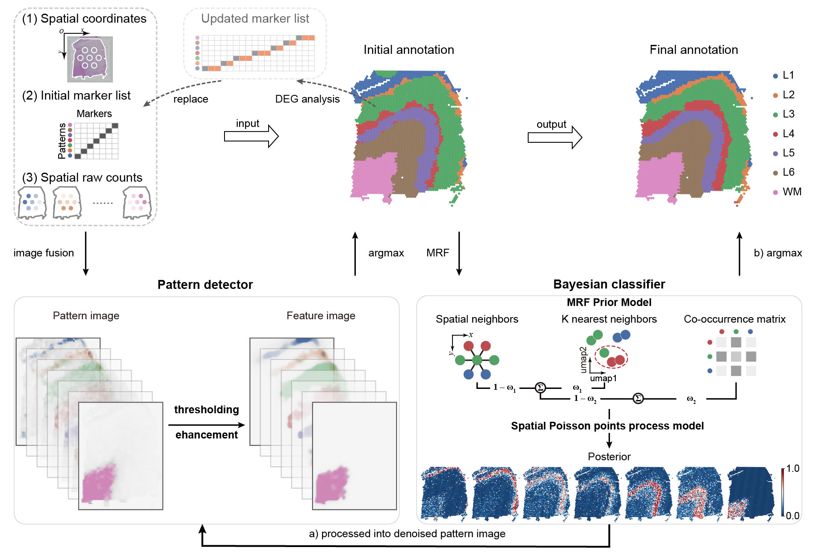

.. StaGATE documentation master file, created by
   sphinx-quickstart on Thu Sep 16 19:43:51 2021.
   You can adapt this file completely to your liking, but it should at least
   contain the root `toctree` directive.

Pianno: a probabilistic framework automating semantic annotation for spatial transcriptomics
=============================================================================

.. toctree::
   :maxdepth: 1

   Installation
   GT151673
   MB
   MOB
   HIP
   BRCA-A
   PDAC-A

Introduction
========
Spatial transcriptomics has revolutionized the study of gene expression within tissues, while preserving spatial
context. However, annotating spatial spots’ biological identity remains a challenge. To tackle this, we introduce
Pianno, a Bayesian framework automating structural semantics annotation based on marker genes. Comprehensive
evaluations underscore Pianno’s remarkable prowess in precisely annotating a wide array of spatial
semantics, ranging from diverse anatomical structures to intricate tumor microenvironments, as well as in
estimating cell type distributions, across data generated from various spatial transcriptomics platforms. Furthermore, Pianno, in conjunction with clustering approaches, uncovers a region- and species-specific excitatory
neuron subtype in the deep layer 3 of the human neocortex, shedding light on cellular evolution in the human
neocortex. Overall, Pianno equips researchers with a robust and efficient tool for annotating diverse biological
structures, offering new perspectives on spatial transcriptomics data.
